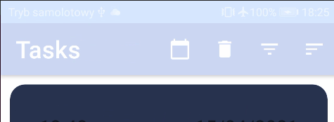
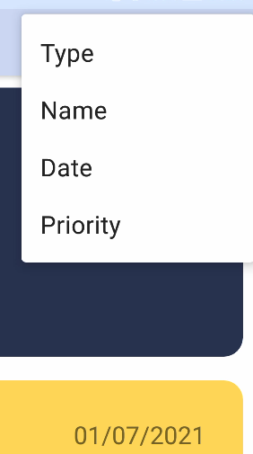
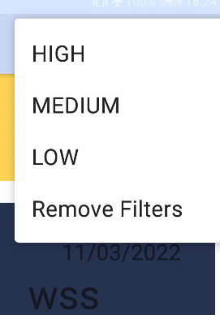
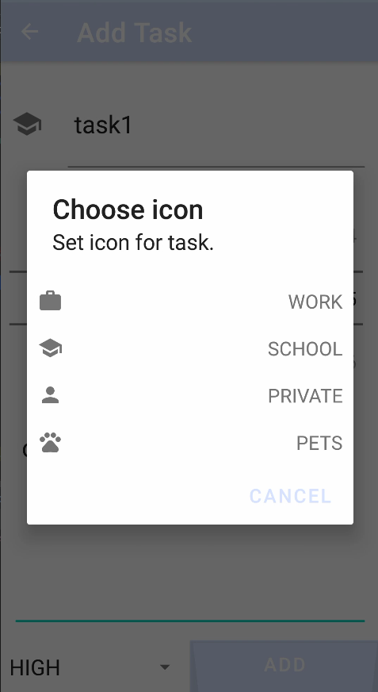
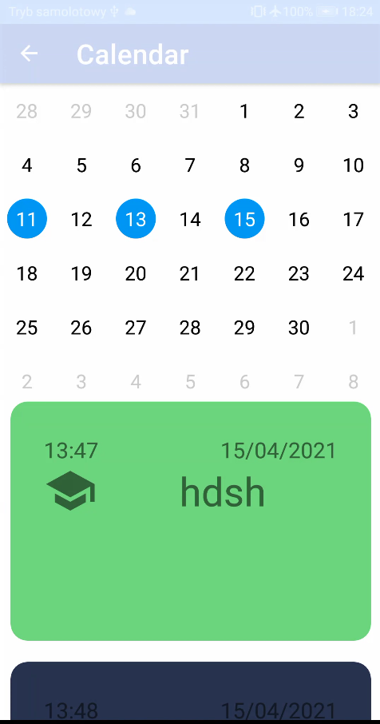
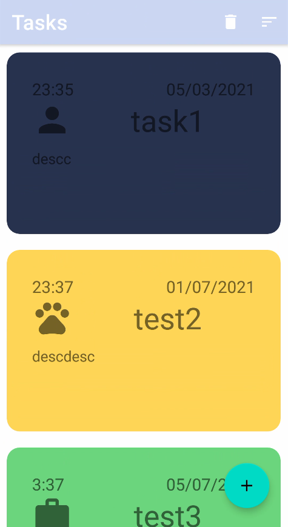
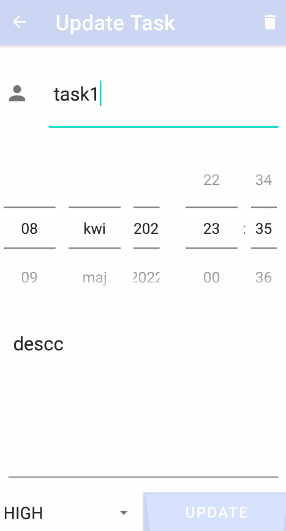
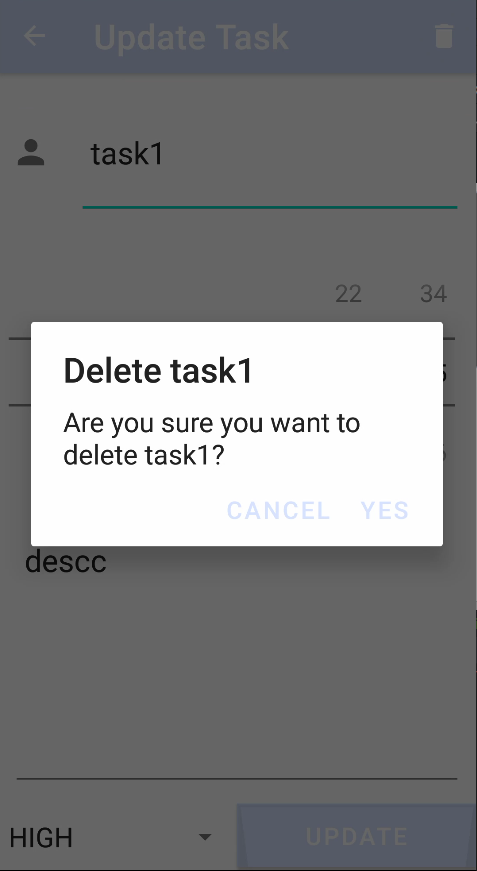
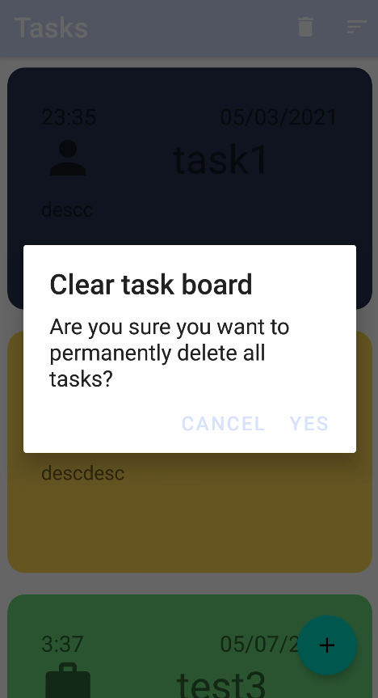
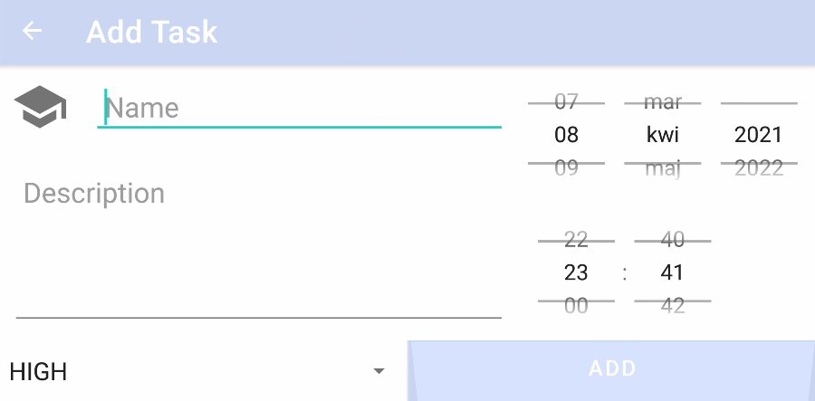

# Table Of Contents
- [Table Of Contents](#table-of-contents)
- [ToDo](#todo)
    - [Introduction](#introduction)
    - [General Info](#general-info)
      - [Sorts](#sorts)
      - [Filter by priority](#filter-by-priority)
      - [Task structure](#task-structure)
      - [Icon chooser](#icon-chooser)
      - [Calendar](#calendar)
    - [Layout](#layout)
      - [Portrait](#portrait)
        - [Tasks list](#tasks-list)
        - [Task update](#task-update)
        - [Task deletion](#task-deletion)
        - [All tasks deletion](#all-tasks-deletion)
      - [Landscape](#landscape)
        - [Tasks list](#tasks-list)
        - [Task addition](#task-addition)
    - [Code Example](#code-example)
----------------------------
# [ToDo](https://github.com/sqoshi/mobile-applications/tree/master/list03/ToDo)

### Introduction
ToDo application in kotlin. This app may be usefull for android users who sometimes forgot about their schedule. 

### General Info
Application allow to add tasks to table in `Room` abstract database (database is instantinated using `singleton pattern`) which is displayed on main fragment of program. During task inserting procedure program adds `alarm` by alarm manager to our phone, so when task is close to expiration date phone vibrates, ringing and user face clickable popup that leads to `ToDo` app activity or creates new one.


User can perform operations as `read`,`add`,`delete`,`update`, `delete-all`, `filter` and `sort` by every field in task table so we can say that app handles CRUD requests.

Few of them can be found inside menu bar.



Application save instances values in outState and remembers thats how configuration of state after rotation.

User can set priority and type of the task.

#### Sorts




#### Filter by priority
Priority is an `Enum(HIGH,MEDIUM,LOW)` each value correspond to the appropriate color of task.



#### Task structure
Task structure: 
```kotlin
data class Task(
    @PrimaryKey(autoGenerate = true)
    val id: Int,
    val name: String,
    val date: Date,
    val description: String,
    val type: String,
    val priority: String,
) : Parcelable
```


#### Icon chooser
Type is responsible for an icon app allows for types as on the screen below:


#### Calendar
All tasks can also be viewed via Calendar. Date click lists all tasks assigned to this day as LiveData.

### Layout
Application handles both landscape and portrait layouts.

#### Portrait
##### Tasks list

##### Task update

##### Task deletion

##### All tasks deletion

#### Landscape
##### Tasks list

##### Task addition


### Code Example

``` kotlin
private fun setUpNotification(hour: Int, minute: Int, day: Int, month: Int, year: Int) {
        val calendar: Calendar = Calendar.getInstance()
        calendar.set(Calendar.HOUR_OF_DAY, hour)
        calendar.set(Calendar.MINUTE, minute)
        calendar.set(Calendar.SECOND, 0)
        calendar.set(Calendar.YEAR, year)
        calendar.set(Calendar.MONTH, month)
        calendar.set(Calendar.DAY_OF_MONTH, day)
        if (calendar.time < Date()) calendar.add(Calendar.DAY_OF_MONTH, 1)
        val intent = Intent(activity?.applicationContext, NotificationReceiver::class.java)
        val pendingIntent = PendingIntent.getBroadcast(
            activity?.applicationContext,
            (0..2147483647).random(),
            intent,
            PendingIntent.FLAG_UPDATE_CURRENT
        )
        val alarmManager =
            activity?.getSystemService(AppCompatActivity.ALARM_SERVICE) as AlarmManager
        alarmManager.setRepeating(
            AlarmManager.RTC_WAKEUP,
            calendar.timeInMillis,
            AlarmManager.INTERVAL_DAY,
            pendingIntent
        )
    }
```

----------------------------
